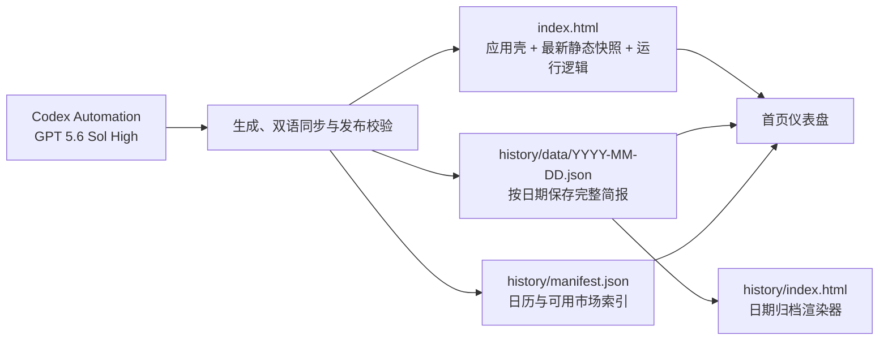

<p align="center">
  <a href="./README.md"></a>
  <a href="./README_EN.md"></a>
</p>

# PreMarketor

> 面向 A股、港股与美股盘前的双市场、双语、可归档研究仪表盘。

PreMarketor 不只是把新闻堆进网页，而是把每日盘前信息组织成一条可检查的决策链：**事实与价格反馈 → 跨资产/板块映射 → 盘前结论 → 个股触发条件 → 逻辑链 → 风险与失效条件 → 数据来源与时间点**。

> 自动化与模型：本项目利用 **Codex Automation + GPT 5.6 Sol High** 生成、更新、校验并发布每日简报。自动化运行在仓库之外；本仓库保存可直接部署的静态产物。

在线站点：[https://premarketor.com/](https://premarketor.com/)

## 项目定位

PreMarketor 将两个不同时区的盘前研究放在同一个工作台中：

- **A股港股早报**：结合隔夜美股、跨资产变化、行业强弱与本地价格反馈，寻找对 A股和港股开盘最有解释力的映射。
- **美股盘前简报**：结合期指、利率、原油、财报与盘前价格反馈，梳理美股开盘前的主线、事件交易和风险条件。
- **历史归档**：每个交易日保存为独立 JSON；首页日历按市场类型标记日期，日期页可以重放完整简报。
- **静态优先**：没有应用服务器、数据库或构建步骤，任意静态托管平台都能部署。

它是研究与信息组织工具，不是实时行情终端、自动交易系统或投资建议服务。

## 系统架构



### 全局页面框架

| 区域 | 职责 | 数据来源 |
| --- | --- | --- |
| 历史日历侧栏 | 展示有归档的日期，并用状态点区分 A股港股与美股简报 | `history/manifest.json` |
| 隔夜美股板块面板 | 展示行业强弱、代表股与市场广度，用于 A股港股映射 | `index.html` 内受保护的中英文板块面板 |
| 顶部控制栏 | 切换中英文、日间/暗夜主题，以及红涨/绿涨颜色习惯 | 浏览器状态与 `localStorage` |
| 双市场工作台 | 独立加载最新 A股港股早报和最新美股盘前简报 | 最新日期 JSON 中的 `AH` / `US` entry |

## 简报模块与研究逻辑

每份简报由可复用模块组成；不同市场或交易日可以增加专属模块，但核心决策链保持一致。

| 层级 | 典型模块 | 解决的问题 |
| --- | --- | --- |
| 事实层 | 重大新闻汇总、美股夜盘行情总结 | 发生了什么？哪些是已确认事实、价格或事件？ |
| 状态层 | 盘前结论、关键资产图、关键词云图 | 当前风险偏好、利率、商品与主题状态是什么？ |
| 映射层 | 板块轮动看板 | 隔夜变化会如何传导到行业与地区市场？ |
| 机会层 | 重点个股推荐、盘后财报 beat 概率 | 哪些标的值得观察？触发因素、验证条件和风险点是什么？ |
| 推理层 | 逻辑链 | 从宏观/事件到板块再到个股的因果链是否闭合？ |
| 风险层 | 风险雷达 | 哪些条件会让当前判断失效或反转？ |
| 证据层 | 数据来源与时间点 | 数据来自哪里、何时抓取、哪些信息存在延迟或缺口？ |

模块内部也有固定语义：

- **关键资产图**：每行保持“资产标签 + 强弱条 + 简短结论”，避免把长篇叙事塞进数值列。
- **个股卡片**：按“推荐/观察理由、触发因素、风险点”组织，不把利好新闻自动等同于做多结论。
- **逻辑链**：强调“驱动 → 传导 → 价格验证 → 失效条件”，而不是孤立罗列观点。
- **情绪颜色**：按句子含义标记正面、负面和观察状态；同时允许用户切换红涨或绿涨习惯。

## 数据模型

### 日历索引

`history/manifest.json` 是轻量索引。`records` 中的每条记录包含日期、当日可用市场类型、合并标题、更新时间和摘要：首页用它生成日历，并分别寻找最新的 `AH` 与 `US` 记录。

### 每日归档

`history/data/YYYY-MM-DD.json` 保存完整内容，核心结构如下：

```json
{
  "date": "YYYY-MM-DD",
  "title": "当日合并标题",
  "updated": "YYYY-MM-DD HH:mm CST",
  "summary": "当日合并摘要",
  "entries": [
    {
      "type": "AH 或 US",
      "label": "市场标签",
      "title": "中文标题",
      "title_en": "English title",
      "summary": "中文摘要",
      "summary_en": "English summary",
      "updated": "更新时间",
      "html": "完整中文模块 HTML",
      "html_en": "完整英文模块 HTML"
    }
  ]
}
```

运行时会将旧记录中的 `A/H` 与当前 `AH` 统一识别为 A股港股类型。

归档不是摘要替代品：`html` / `html_en` 保存完整模块树。较早记录如果没有 `html_en`，英文界面会显示明确的不可用提示，而不是伪造翻译。

## 浏览器运行流程

1. 页面在首屏绘制前读取已保存的主题，减少日间/暗夜切换闪烁。
2. 首页以 `cache: no-store` 读取 `history/manifest.json`，按日期倒序生成日历。
3. 前端分别寻找最新的 A股港股和美股记录；两类简报不要求来自同一个日期。
4. 页面读取对应日期 JSON，并按当前语言注入 `html` 或 `html_en`。
5. 英文模式将可识别的 CST 时间转换为纽约时区显示。
6. `IntersectionObserver` 负责模块渐进显示；不支持时自动降级为直接展示。
7. 历史链接使用 `history/?date=YYYY-MM-DD`，由日期渲染器读取对应 JSON。

`index.html` 同时内嵌最新静态快照和更新 markers，因此即使动态请求尚未完成，页面仍有结构化内容；加载成功后再由归档数据刷新为最新记录。

## 交互与可访问性

- 中文 / English 即时切换；中英文简报共享同一套模块 class 与布局规则。
- 日间 / 暗夜主题切换，主题选择写入 `localStorage`。
- 支持绿涨红跌与红涨绿跌两种颜色习惯，并保存用户选择。
- 响应式布局：宽屏双市场并排，窄屏自动改为单列。
- 支持 `prefers-reduced-motion`、`prefers-reduced-transparency` 与高对比偏好。
- 控制按钮使用 `aria-label` / `aria-pressed` 表达状态。

## 仓库结构

```text
PreMarketor/
├── index.html                     # 首页壳、样式、最新静态快照与运行逻辑
├── README.md                      # 默认中文版文档
├── README_EN.md                   # English documentation
└── history/
    ├── index.html                 # ?date=YYYY-MM-DD 日期渲染器
    ├── manifest.json              # 归档日历索引
    └── data/
        └── YYYY-MM-DD.json        # 当日 AH / US 简报（英文按记录可用）
```

项目没有 `package.json`、数据库或编译产物；HTML、CSS、JavaScript 与 JSON 可以直接托管。

## 本地运行

不要使用 `file://` 直接测试动态归档请求；在仓库根目录启动静态服务器：

```sh
python3 -m http.server 8000
```

然后访问：

- 首页：`http://localhost:8000/`
- 指定日期：`http://localhost:8000/history/?date=YYYY-MM-DD`

## AKShare 云端行情证据

仓库提供一个仅依赖 AKShare 的 A股/港股行情抓取入口。它会依次尝试 AKShare
中的东方财富和新浪接口，输出代表指数、市场涨跌家数、中位涨跌幅以及领涨/领跌
样本，并将结果写入 `data/akshare-latest.json`：

```sh
python3 -m pip install -r requirements.txt
python3 scripts/fetch_akshare_snapshot.py
```

只有 A股或港股指数基线均不可用时命令才以非零状态退出；个股宽度不完整会将
`status` 标记为 `partial`、`analysisReady` 标记为 `false`。每日简报生成器应把
该 JSON 作为分析证据：盘前抓取会明确标记为上一交易时段收盘基线，用于校准
风险偏好、板块轮动和当天量价验证条件，不作为独立页面模块，也不得冒充实时行情。

## 更新与发布契约

一次完整的每日发布需要保持三个目标同步：

1. 更新 `index.html` 中对应市场的 latest snapshot、时间与 updated markers。
2. 写入或更新当天 `history/data/YYYY-MM-DD.json`，同时维护中文 `html` 与英文 `html_en`。
3. 更新 `history/manifest.json`，保留全部历史日期和已有市场类型。

发布前应至少验证：

- 只修改目标市场 markers，另一市场与共享板块面板保持不变。
- 中英文模块顺序、class、直接子节点、条目数量和关键数值一致。
- JSON 可以解析，manifest 中的每个日期都有对应文件。
- 首页能加载最新 A股港股与美股简报，历史日期链接可以回放。
- GitHub main、fresh clone 与线上静态文件指向同一版本。

## 已知边界

- 内容时效取决于最近一次自动化发布，不承诺逐笔实时更新。
- 部分早期归档没有英文 HTML；前端会明确降级提示。
- 历史日期页当前渲染归档中的中文 `html`；首页负责完整的中英文切换体验。
- 项目不包含账户、服务端 API、交易接口、推送通知或投资组合管理。

## 免责声明

本项目仅用于市场研究与信息整理，不构成任何投资建议。所有价格、事件、概率判断与映射关系都应在交易前通过原始来源和实时市场数据再次核验。
