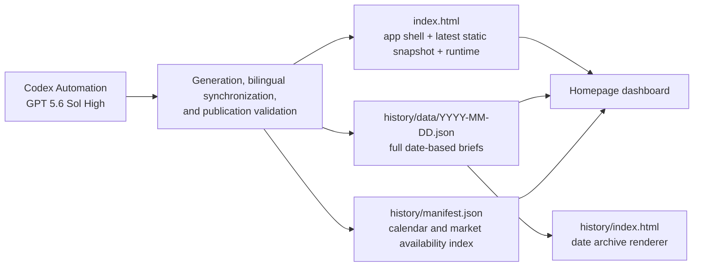

<p align="center">
  <a href="./README.md"></a>
  <a href="./README_EN.md"></a>
</p>

# PreMarketor

> A bilingual, archive-first research dashboard for China A-shares, Hong Kong equities, and US premarket sessions.

PreMarketor does more than place headlines on a page. It organizes each premarket brief into an auditable decision chain: **facts and price feedback → cross-asset/sector mapping → premarket conclusion → stock triggers → causal logic → risks and invalidation → sources and timestamps**.

> Automation and model: This project uses **Codex Automation + GPT 5.6 Sol High** to generate, update, validate, and publish each daily brief. The automation runs outside this repository; this repository stores the deployable static artifacts.

Live site: [https://market-ahead-open.vercel.app/](https://market-ahead-open.vercel.app/)

## Purpose

PreMarketor brings research for two market windows into one workspace:

- **A-share and Hong Kong morning brief**: maps overnight US moves, cross-asset changes, industry breadth, and local price feedback into signals relevant to the A-share and Hong Kong opens.
- **US premarket brief**: organizes futures, rates, oil, earnings, and premarket price reactions into opening themes, event trades, and risk conditions.
- **Historical archive**: stores each trading day as a standalone JSON record; the homepage calendar marks available market types and date pages replay the full brief.
- **Static-first delivery**: requires no application server, database, or build step and can run on any static host.

It is a research and information-organization tool—not a real-time market terminal, automated trading system, or investment-advice service.

## System Architecture



### Global Page Frame

| Area | Responsibility | Data source |
| --- | --- | --- |
| Archive calendar sidebar | Shows archived dates and distinguishes A-share/Hong Kong and US records with status dots | `history/manifest.json` |
| Overnight US sector panel | Shows industry leaders/laggards, representative stocks, and breadth for cross-market mapping | Protected Chinese and English panel blocks in `index.html` |
| Top control bar | Switches language, light/dark theme, and red-up/green-up market color conventions | Browser state and `localStorage` |
| Dual-market workspace | Loads the latest A-share/Hong Kong brief and latest US brief independently | `AH` / `US` entries in the latest matching date JSON |

## Brief Modules and Research Logic

Each brief is built from reusable modules. A market or trading day may add a specialized module, but the core decision chain remains stable.

| Layer | Typical modules | Question answered |
| --- | --- | --- |
| Facts | Major news, US overnight summary | What happened, and which facts, prices, or events are confirmed? |
| State | Premarket conclusion, key asset map, keyword cloud | What is the current risk, rates, commodity, and theme regime? |
| Mapping | Sector rotation board | How can overnight moves transmit across industries and regions? |
| Opportunities | Stock picks, after-hours earnings beat probability | What deserves attention, and what are the trigger, validation, and risk conditions? |
| Reasoning | Logic chain | Does the causal path from macro/event to sector to stock close coherently? |
| Risk | Risk radar | What could invalidate or reverse the current view? |
| Evidence | Sources and timestamps | Where did the data come from, when was it captured, and where are delays or gaps? |

The modules also enforce internal semantics:

- **Key asset map**: each row stays “asset label + strength bar + short verdict,” keeping long narrative out of the value column.
- **Stock card**: separates rationale, trigger, and risk; a favorable headline is not automatically treated as a long signal.
- **Logic chain**: follows “driver → transmission → price confirmation → invalidation” instead of listing disconnected opinions.
- **Sentiment color**: reflects sentence meaning while still allowing users to choose red-up or green-up conventions.

## Data Model

### Calendar Index

`history/manifest.json` is a lightweight index. Each item in `records` contains a date, available market types, combined title, update time, and summary. The homepage uses it to build the calendar and to locate the latest `AH` and `US` records independently.

### Daily Archive

`history/data/YYYY-MM-DD.json` stores full content using this core shape:

```json
{
  "date": "YYYY-MM-DD",
  "title": "Combined daily title",
  "updated": "YYYY-MM-DD HH:mm CST",
  "summary": "Combined daily summary",
  "entries": [
    {
      "type": "AH or US",
      "label": "Market label",
      "title": "Chinese title",
      "title_en": "English title",
      "summary": "Chinese summary",
      "summary_en": "English summary",
      "updated": "Update time",
      "html": "Full Chinese module HTML",
      "html_en": "Full English module HTML"
    }
  ]
}
```

The runtime normalizes legacy `A/H` and current `AH` labels to the same A-share/Hong Kong market type.

The archive is not a summary substitute: `html` / `html_en` preserve the full module tree. When an older record has no `html_en`, the English UI shows an explicit unavailable message instead of inventing a translation.

## Browser Runtime

1. Before first paint, the page reads the saved theme to reduce light/dark flashing.
2. The homepage fetches `history/manifest.json` with `cache: no-store`, sorts records by date, and renders the calendar.
3. The runtime finds the latest A-share/Hong Kong and US records independently; they do not have to share a date.
4. It fetches the matching daily JSON and injects `html` or `html_en` for the selected language.
5. English mode converts recognized CST timestamps to the New York time zone.
6. `IntersectionObserver` reveals modules progressively and falls back to immediate display when unsupported.
7. Archive links use `history/?date=YYYY-MM-DD`; the date renderer fetches the matching JSON.

`index.html` also embeds the latest static snapshots and update markers. The page therefore has structured content before dynamic archive requests complete, then refreshes from archive data when loading succeeds.

## Interaction and Accessibility

- Instant Chinese / English switching; both languages share the same module classes and layout rules.
- Persistent light / dark theme using `localStorage`.
- Persistent red-up/green-down or green-up/red-down color convention.
- Responsive layout: two markets side by side on wide screens, one column on narrow screens.
- Support for `prefers-reduced-motion`, `prefers-reduced-transparency`, and increased-contrast preferences.
- Stateful controls expose `aria-label` / `aria-pressed` attributes.

## Repository Structure

```text
PreMarketor/
├── index.html                     # app shell, styles, latest snapshots, and runtime
├── README.md                      # default Chinese documentation
├── README_EN.md                   # English documentation
└── history/
    ├── index.html                 # ?date=YYYY-MM-DD archive renderer
    ├── manifest.json              # archive calendar index
    └── data/
        └── YYYY-MM-DD.json        # daily AH / US briefs; English when available
```

There is no `package.json`, database, or compiled output. The HTML, CSS, JavaScript, and JSON can be hosted directly.

## Run Locally

Do not use `file://` when testing dynamic archive requests. Start a static server from the repository root:

```sh
python3 -m http.server 8000
```

Then open:

- Homepage: `http://localhost:8000/`
- Specific date: `http://localhost:8000/history/?date=YYYY-MM-DD`

## AKShare Cloud Market Evidence

The repository includes an AKShare-only A-share/Hong Kong data collector. It tries
Eastmoney first and Sina as a fallback, then emits representative indexes, market
breadth, median percentage change, and leading/lagging samples:

```sh
python3 -m pip install -r requirements.txt
python3 scripts/fetch_akshare_snapshot.py
```

The command exits non-zero only when both index baselines cannot be obtained. A
missing breadth source produces `status: "partial"` and `analysisReady: false`.
The daily brief generator uses the JSON as evidence for risk appetite, sector
rotation, and same-day price/volume validation. A pre-open result is explicitly a
previous-session close baseline; it is not a standalone page panel or a live quote.

GitHub Actions refreshes this JSON in the cloud at 08:35 and 09:05
(Asia/Shanghai) on weekdays. The 08:50/09:10 brief jobs prefer the fresh checked-in
file and only try a local fetch when it is missing or stale, so market evidence does
not depend on the host reaching Eastmoney or Sina directly.

## Update and Publication Contract

A complete daily publication keeps three targets synchronized:

1. Update the intended market's latest snapshot, time, and updated markers in `index.html`.
2. Create or update `history/data/YYYY-MM-DD.json`, maintaining both Chinese `html` and English `html_en`.
3. Update `history/manifest.json` without dropping previous dates or existing market types.

At minimum, validate before publishing that:

- Only the intended market markers changed; the opposite market and shared sector panel remained intact.
- Chinese and English module order, classes, direct-child structure, item counts, and key values match.
- JSON parses and every manifest date has a corresponding file.
- The homepage loads the latest A-share/Hong Kong and US briefs and archive links replay the selected date.
- GitHub main, a fresh clone, and the deployed static file resolve to the same version.

## Known Boundaries

- Freshness depends on the latest automation run; the project does not promise tick-by-tick updates.
- Some early archives do not contain English HTML; the UI degrades explicitly.
- The date archive page currently renders the archived Chinese `html`; the homepage provides the full bilingual switching experience.
- The project has no accounts, server API, trading connection, notifications, or portfolio management.

## Disclaimer

This project is for market research and information organization only. It is not investment advice. Verify every price, event, probability estimate, and cross-market mapping against primary sources and live market data before trading.
